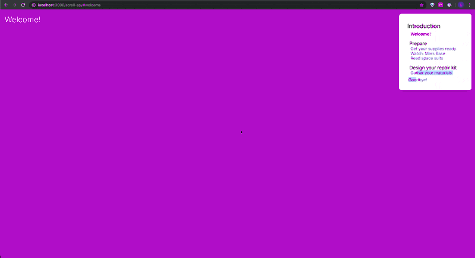

# Scroll Spy

> Created as a submission for the primer frontend take-home



## Examples

_Note: In Codesandbox the clicking on links and HMR can cause errors not related to scroll-spy_

- Basic Nav - [Live](https://lucas8.github.io/scroll-spy) - [Source](./example)

## Installation

_Note: This doesn't actually work because the package is not on npm. But feel free to copy the [components](./src/components) into your own projects_

```bash
$ npm i --save scroll-spy
# or
$ yarn add scroll-spy
```

## Usage

### Getting Started

To get started, wrap all of the components you want to use with scroll-spy inside of the `<ScrollSpyProvider />`

You are able to pass in [options](https://developer.mozilla.org/en-US/docs/Web/API/Intersection_Observer_API#Intersection_observer_options) to the ScrollSpyProvider which will effect the Intersection Observer. The only default value is threshold which is set to 0.5.

```js
import React from 'react'
import { ScrollSpyProvider, Section, Topic } from 'scroll-spy'

function App() (
  <ScrollSpyProvider>
    {/* ... */}
  </ScrollSpyProvider>
)
```

### The Scroll Component

The scroll component is used to add React nodes to the observation tree. You can add an item using the following syntax.

The `id` props is the hash that will identify the section.
eg. http://localhost:3000/#my-new-section.

The `title` is the string that will be added to the observation tree and can be accessed later on using `useSpyScrollState`.

```js
<Section id='my-new-section' title='My New Section'>
  <h1>My new section</h1>
</Section>
```

#### Make your own scroll component

You can make your own scroll component using the exposed `useSpyScroll` hook, which you can pass in as a hook value and will be added to the tree as well.

```js
const ref = useSpyScroll()

<div id={id} ref={(i) => ref(i, {title: "My New Section", topic: "Intro to Elixir"})}></div>
```

### Topics!

You can use the `<Topic />` component to declare a topic. Topics stack up to 2 layers of depth, which means you can have a topic & subtopic.

```js
<Topic name='Information'>
  <Topic name='details'>
    <Section id='my-new-section' title='My New Section'>
      {/* */}
    </Section>
  </Topic>
</Topic>
```
